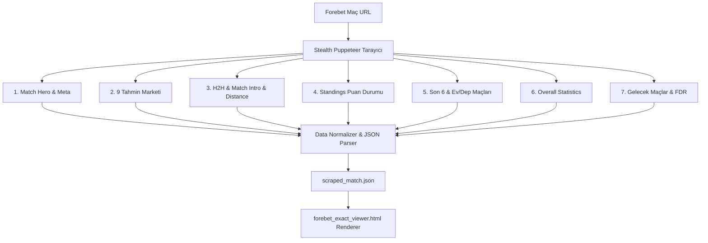

# 🚀 BPA V3 FOREBET MASTER SCRAPER & FIELD SPECIFICATION PLAN
**Versiyon:** 3.0.0-PRO  
**Tarih:** 17 Ağustos 2026  
**Hedef Modül:** `bpav3yenibot` (BPA V3 Yeni Nesil Canlı Veri Kazıma & Eşleme Motoru)  
**Mimari Kapsam:** Tek Link Denetim Modu + Günlük Toplu Çekim Pipeline + Otomatik HTML Görüntüleyici  

---

## 📌 1. PROJE ÖZETİ VE HEDEFLER

Kullanıcının ilettiği Forebet maç linkini (örn: `https://www.forebet.com/en/football/matches/besiktas-ey%C3%BCpspor-2494866`) girdi olarak alan; sayfadaki **HER BİR BÖLÜMÜ** hiçbir yapay/manuel dummy veri kullanmadan, %100 saf canlı kaynaktan çekip JSON şemasına normalize eden ve Forebet masaüstü 1:1 formatındaki HTML sayfasına basarak anında kullanıcıya sunan modüler bir bot motoru inşa edilmektedir.

### 🎯 Temel Prensipler:
1. **Sıfır Manuel Müdahale / Saf Dinamik Veri:** Botun çekemediği veya sayfada bulunmayan veriler için sahte metin üretilmez, alan `null` veya `-` bırakılır.
2. **Modüler Adım Adım Mimari:** Her veri bloğu (Hero, 9 Market, H2H, Standings, Son 6 Maç, Overall Stats, Next Matches) bağımsız parser fonksiyonlarına ayrılır.
3. **Cloudflare & Bot Savunması Korumalı:** Gelişmiş Stealth Evasion, WebGL donanım spoofing, otomatik çerez önbelleği ve retry mekanizması.
4. **Çift Çalışma Modu:**
   - **Mod A (Tek Maç Denetim Modu):** Kullanıcı linki girer (`node scrape_match.js --url="..."`), bot tüm sayfayı kazır, `match_result.json` ve `match_viewer.html` üretir ve kontrol edilmesini ister.
   - **Mod B (Günlük Toplu Çekim Pipeline):** BPA V3 ana motoru günün tüm maçlarını eşzamanlı sekmelerle çeker, veritabanına ve web paneline aktarır.

---

## 🏗️ 2. BÖLÜM BÖLÜM VERİ KAZIMA & SEÇİCİ (SELECTOR) HARİTASI



---

### 🟢 ADIM 1: MATCH HERO, TAKIMLAR, LOGOLAR & FORM ÇİZGİLERİ

Hero bölümü maçın ana başlığını, takımları, maç tarih/saatini, stadyumu, hava durumunu, skor/durumu ve takımların son 6 maçlık form durumunu içerir.

| Alan Adı | JSON Anahtarı | Forebet DOM Seçicisi / Çıkarım Yolu | Örnek Çıktı |
| :--- | :--- | :--- | :--- |
| **Ev Sahibi Takım** | `homeTeam` | `.st_hteam, .schema_h2h .st_hteam` | `"Beşiktaş"` |
| **Deplasman Takım** | `awayTeam` | `.st_ateam, .schema_h2h .st_ateam` | `"Eyüpspor"` |
| **Ev Sahibi Kısa Kod** | `homeShort` | `.st_hteam .shortTag, .st_tag` veya ilk 3 harf | `"BJK"` |
| **Deplasman Kısa Kod** | `awayShort` | `.st_ateam .shortTag, .st_tag` veya ilk 3 harf | `"EYU"` |
| **Ev Sahibi Logo** | `homeLogo` | `.st_hteam img, .os_home_team_img img` (Canvas Base64 fallback) | `"https://www.forebet.com/images/logos/..."` |
| **Deplasman Logo** | `awayLogo` | `.st_ateam img, .os_away_team_img img` (Canvas Base64 fallback) | `"https://www.forebet.com/images/logos/..."` |
| **Lig & Ülke** | `leagueName`, `country` | `.st_lgs, .breadcrumbs a[href*='/football/']` | `"Turkey Süper Lig"`, `"Turkey"` |
| **Hafta / Sezon** | `round` | `.st_lgs` içindeki regex (`Round \d+`) | `"Round 1, Regular Season"` |
| **Tarih & Saat** | `matchDate`, `matchTime` | `.st_date, .date, .st_arrdt` | `"16/08/2026 21:30"` |
| **Stadyum & Şehir** | `stadium`, `city` | `.st_venue, .venue` | `"Beşiktaş Park, Istanbul"` |
| **Hava Durumu & Derece** | `weather`, `temperature`, `weatherIcon` | `.st_weather, .weatherWrap` | `"27°C"`, `"Sunny/Cloudy"`, `"https://www.forebet.com/images/w-26.png"` |
| **Maç Durumu & Skor** | `status`, `score` | `.st_res, .st_scrblock, .st_ft` | `"FT"`, `"1 - 0"`, `"HT (1 - 0)"` |
| **Ev Sahibi Form** | `homeForm` | `.st_hteam_form span, .home-form span` | `["W", "W", "W", "W", "D", "L"]` |
| **Deplasman Form** | `awayForm` | `.st_ateam_form span, .away-form span` | `["D", "W", "D", "W", "W", "L"]` |

---

### 🟢 ADIM 2: 9 TAHMİN MARKETİ (PREDICTION TABS & TABLES)

Forebet maç sayfasında 9 farklı tahmin sekmesi bulunmaktadır. Bot bu sekmeleri doğrudan DOM'dan veya sekmelerin butonlarına tıklayarak (`#m1x2_t_butt`, `#uo_t_butt` vb.) aktif tablolardan çeker.

```
[ 1X2 ]  [ Under/Over 2.5 ]  [ Half Time ]  [ HT/FT ]  [ BTTS ]  [ Handicap ]  [ Scorers ]  [ Corners ]  [ Cards ]
```

| Market | JSON Anahtarı | DOM Buton ID & Tablo Seçicisi | Çekilen Parametreler |
| :--- | :--- | :--- | :--- |
| **1. 1X2 (Maç Sonu)** | `markets.1x2` | `#m1x2_t_butt` / `#tab_1x2, #m1x2_tab` | `prob1` (%61), `probX` (%24), `prob2` (%15), `pick` ("1"), `correctScore` ("3-1"), `avgGoals` ("3.13"), `odds` (1.30) |
| **2. Under / Over 2.5** | `markets.uo` | `#uo_t_butt` / `#tab_uo, #uo_tab` | `underProb` (%40), `overProb` (%60), `pick` ("Over 2.5"), `correctScore` ("3-1"), `avgGoals` ("3.13"), `odds` (1.65) |
| **3. Half Time (İY)** | `markets.ht` | `#ht_t_butt` / `#tab_ht, #ht_tab` | `htProb1` (%55), `htProbX` (%30), `htProb2` (%15), `pick` ("1"), `htScore` ("1-0"), `odds` (1.75) |
| **4. HT / FT (İY/MS)** | `markets.htft` | `#htft_t_butt` / `#tab_htft, #htft_tab` | `pick` ("1 / 1"), `correctScore` ("3-1"), `odds` (1.90) |
| **5. BTTS (KG Var/Yok)**| `markets.btts` | `#bts_t_butt` / `#tab_bts, #bts_tab` | `bttsYesProb` (%58), `bttsNoProb` (%42), `pick` ("Yes"), `correctScore` ("3-1"), `odds` (1.70) |
| **6. Handicap** | `markets.handicap` | `#ah_t_butt, #eh_t_butt` / `#tab_handicap` | `handicapType` ("Home -1"), `handicapPick` ("1"), `handicapLine` ("-1.0"), `odds` (1.85) |
| **7. Scorers (Golcüler)**| `markets.scorers` | `#scors_t_butt` / `#tab_scorers` | `players`: `[{ name: "Ciro Immobile", team: "BJK", prob: "48%" }, { name: "Rafa Silva", team: "BJK", prob: "35%" }]` |
| **8. Corners (Korner)** | `markets.corners` | `#cor_t_butt` / `#tab_corners` | `line` ("9.5"), `overProb` (%54), `underProb` (%46), `pick` ("Over 9.5"), `odds` (1.80) |
| **9. Cards (Kartlar)** | `markets.cards` | `#card_t_butt` / `#tab_cards` | `line` ("4.5"), `overProb` (%62), `underProb` (%38), `pick` ("Over 4.5"), `odds` (1.75) |

---

### 🟢 ADIM 3: HEAD TO HEAD (H2H), MATCH INTRO & KUŞ UÇUŞU MESAFE

1. **H2H Karşılaşmaları:**
   - Seçici: `.h2h_table tr, table.schema_h2h tr, div[onclick*='/matches/']`
   - Çıkarılan Alanlar: Tarih (`date`), Ev Sahibi (`home`), Deplasman (`away`), Skor (`score`), İY Skoru (`htScore`), Turnuva/Lig (`league`), Kazanan Taraf Vurgusu (`W/D/L`).
   - H2H Özet Çubuğu: `.st_perc_stat, .st_row_perc` -> Takım 1 Galibiyet Sayısı & %, Beraberlik Sayısı & %, Takım 2 Galibiyet Sayısı & %.

2. **Forebet AI Match Intro (Maç Ön Bakış Metni):**
   - Seçici: `.match_intro_text, .match_intro, .preview_text`
   - Çıkarılan Alan: Birebir Forebet editöryal maç analizi ve tarihi (`introText`, `introDate`).

3. **Kuş Uçuşu Mesafe (Straight Line Distance):**
   - Seçici: `.st_dstc, .st_distance`
   - Çıkarılan Alanlar: Şehir/İlçe 1 (`Istanbul Beşiktaş`), Şehir/İlçe 2 (`Istanbul Eyüp`), Mesafe KM (`8 km`), Stadyum 1 (`Beşiktaş Park`), Stadyum 2 (`Eyüp Stadium`).

---

### 🟢 ADIM 4: STANDINGS (LİG PUAN DURUMU)

- Seçici: `table.teamtablesp, table.standings`
- Çıkarılan Tablo Sütunları:
  - Sıra (`rank`)
  - Takım Adı (`teamName`)
  - Puan (`pts`)
  - Oynanan Maç (`gp` / `played`)
  - Galibiyet (`w`), Beraberlik (`d`), Mağlubiyet (`l`)
  - Atılan Gol (`gf`), Yenilen Gol (`ga`), Averaj (`gd`)
  - **Aktif Maç Takımlarının Vurgulanması:** O anki maçın ev sahibi ve deplasman takımlarının satırları tabloda sarı renkle (`highlight: true`) işaretlenir.

---

### 🟢 ADIM 5: SON 6 MAÇ & EV/DEPLASMAN FORMLARI (2x2 GRID)

4 ayrı tablodan oluşur:
1. **Ev Sahibi Son 6 Maç (Tüm Kulvarlar):** Lig sekmeleri (`All`, `Süper Lig`, `Conference League` vb. filtre butonları ile).
2. **Deplasman Son 6 Maç (Tüm Kulvarlar):** Lig sekmeleri (`All`, `Süper Lig` vb.).
3. **Ev Sahibi Sadece Evindeki Son 6 Maç.**
4. **Deplasman Sadece Deplasmandaki Son 6 Maç.**

- Her Maç Satırından Çıkarılanlar:
  - Tarih (`date`)
  - Ev Takımı (`home`), Deplasman Takımı (`away`)
  - Skor (`score`) ve İY Skoru (`htScore`)
  - Lig/Turnuva Kodu (`leagueTag` -> `TR1`, `ECL`, `CUP` vb.)
  - Sonuç Rengi/Badge (`W` Yeşil, `D` Sarı, `L` Kırmızı)

---

### 🟢 ADIM 6: OVERALL STATISTICS (İKİ KOLONLU DETAYLI İSTATİSTİKLER)

Forebet'in `get_ovd` istatistik motorunun sağladığı tüm ham sayısal veriler:

| İstatistik Bloğu | Forebet DOM Sınıfı | Çıkarılan Metrikler |
| :--- | :--- | :--- |
| **Oynanan Maçlar** | `.os_played_games_container` | Ev Maç Sayısı (6), Dep Maç Sayısı (6) |
| **Gol İstatistikleri** | `.os_goals_section1_main` | Atılan Goller & Ort, Yenilen Goller & Ort, Gol Atılan Maç Yüzdesi (%100 vs %100) |
| **Alt / Üst & KG Pasta Grafikler** | `.os_goals_section3_container` | 1.5 Üst %, 2.5 Üst %, 3.5 Üst %, Karşılıklı Gol Var % |
| **Zaman Aralıklarına Göre Goller** | `.os_goals_by_tp_cont` | 0-15', 16-30', 31-45', 46-60', 61-75', 76-90' histogram değerleri |
| **Şutlar (Shots)** | `.os_shots_parent` | Toplam Şut, Engellenen, İsabetli %, İsabetsiz %, Ceza Sahası İçi %, Ceza Sahası Dışı % |
| **Paslar & Topla Oynama** | `.os_passes_container` | Toplam Pas, İsabetli Pas Sayısı ve %, Topla Oynama % |
| **Ortalama Olay Zamanı** | `.os_events` | İlk Gol Dakikası, İlk Korner Dakikası, İlk Kart Dakikası |
| **Ataklar (Attacks)** | `.os_attacks_section` | Toplam Atak Sayısı & Ort, Tehlikeli Atak Sayısı & Ort |
| **Diğer İstatistikler** | `.os_others_container` | Gol Yememe (Clean Sheet), Kornerler, Autlar, Ofsaytlar, Kaleci Kurtarışları |
| **Disiplin (Disciplinary)** | `.os_aggressions_cont` | Kırmızı Kartlar, Sarı Kartlar, Fauller, İkili Mücadeleler (Tackles) |

---

### 🟢 ADIM 7: GELECEK MAÇLAR & ZORLUK DERECESİ (NEXT MATCHES & FDR)

- Seçici: `.next_matches, .st_next, .nm_table`
- Çıkarılan Alanlar:
  - Takım 1 Sonraki 4-6 Maç: Rakip, Ev/Deplasman (`H` / `A`), Tarih, Turnuva Kodu, **FDR Zorluk Rozeti (1-5 Puanı ve Yeşil-Sarı-Kırmızı Renk Kodu)**.
  - Takım 2 Sonraki 4-6 Maç: Rakip, Ev/Deplasman (`H` / `A`), Tarih, Turnuva Kodu, **FDR Zorluk Rozeti (1-5 Puanı)**.

---

## 🛠️ 3. YENİ BOT KLASÖR YAPISI (`bpav3yenibot`)

```
c:\xampp\htdocs\bpiv2\windows\bpav3yenibot\
│
├── DOCS_FOREBET_SCRAPER.md          # Bu master dokümantasyon
├── package.json                     # Bağımlılıklar (puppeteer, cheerio, chalk vs.)
│
├── config/
│   ├── scraper_config.json          # Zaman aşımları, user-agent, bypass ayarları
│   └── league_flags_map.json        # Lig ve ülke bayrakları eşleme tablosu
│
├── core/
│   ├── browser_pool.js              # Stealth Puppeteer & Cloudflare bypass yöneticisi
│   ├── dom_selectors.js             # Tüm Forebet CSS & XPath seçici sabitleri
│   └── data_normalizer.js           # JSON şeması doğrulama ve temizleme motoru
│
├── parsers/
│   ├── parse_hero.js                # Adım 1: Hero, takımlar, logolar, form serisi
│   ├── parse_markets.js             # Adım 2: 9 Tahmin Pazarı ayrıştırıcısı
│   ├── parse_h2h_intro.js           # Adım 3: H2H, Intro metni, Kuş uçuşu mesafe
│   ├── parse_standings.js           # Adım 4: Lig puan durumu tablosu
│   ├── parse_last_matches.js        # Adım 5: Son 6 ve Ev/Dep maçları
│   ├── parse_overall_stats.js       # Adım 6: Overall istatistikler ve histogramlar
│   └── parse_next_matches.js        # Adım 7: Gelecek maçlar ve FDR zorluk puanları
│
├── viewer/
│   ├── match_viewer.html            # 1:1 Masaüstü Forebet Görüntüleyici Şablonu
│   └── generate_viewer.js           # Kazınan JSON'ı HTML'e bağlayan motor
│
├── scrape_match.js                  # 🎯 KULLANICI MASAÜSTÜ TEK LİNK BOT ÇALIŞTIRICISI
└── daily_pipeline_v3.js             # 🚀 BPA V3 GÜNLÜK TOPLU ÇEKİM ANA BOTU
```

---

## 💻 4. KULLANICI İÇİN TEK LİNK BOT KULLANIM ŞEKLİ

Kullanıcı masaüstünden veya terminalden sadece linki vererek botu çalıştırır:

```bash
node scrape_match.js --url="https://www.forebet.com/en/football/matches/besiktas-ey%C3%BCpspor-2494866"
```

**Botun Yapacağı İşlem:**
1. Sayfayı açar, Cloudflare'i geçer.
2. 7 adımı sırasıyla çalıştırır ve konsola renkli ilerleme basar:
   ```
   [14:45:00] 📡 Sayfaya bağlanıldı: Beşiktaş vs Eyüpspor
   [14:45:02] ✅ 1. Hero & Takım Formları çekildi (BJK: WWWWDL, EYU: DWDWWL)
   [14:45:04] ✅ 2. 9 Tahmin Marketi çekildi (1X2: 61-24-15, U/O: 40-60...)
   [14:45:05] ✅ 3. H2H (5 maç), Intro ve Mesafe (8 km) çekildi
   [14:45:06] ✅ 4. Puan Durumu çekildi (18 takım)
   [14:45:08] ✅ 5. Son 6 & Ev/Dep Maçları çekildi (Lig filtreleri aktif)
   [14:45:09] ✅ 6. Overall İstatistikler çekildi (Şut, Pas, Histogram, Disiplin)
   [14:45:10] ✅ 7. Gelecek Maçlar & FDR çekildi
   [14:45:11] 🎉 match_result.json ve match_viewer.html oluşturuldu!
   [14:45:12] 🌐 Tarayıcıda açılıyor: match_viewer.html
   ```
3. Kullanıcı tarayıcıda açılan HTML sayfasında verileri inceler.
4. Eksiksiz olduğu teyit edildiğinde bot `daily_pipeline_v3.js` olarak günün tüm maçlarını kazımak üzere BPA V3 ana sistemine entegre edilir.
